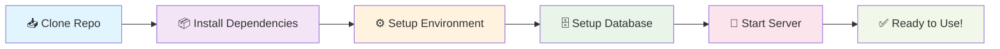
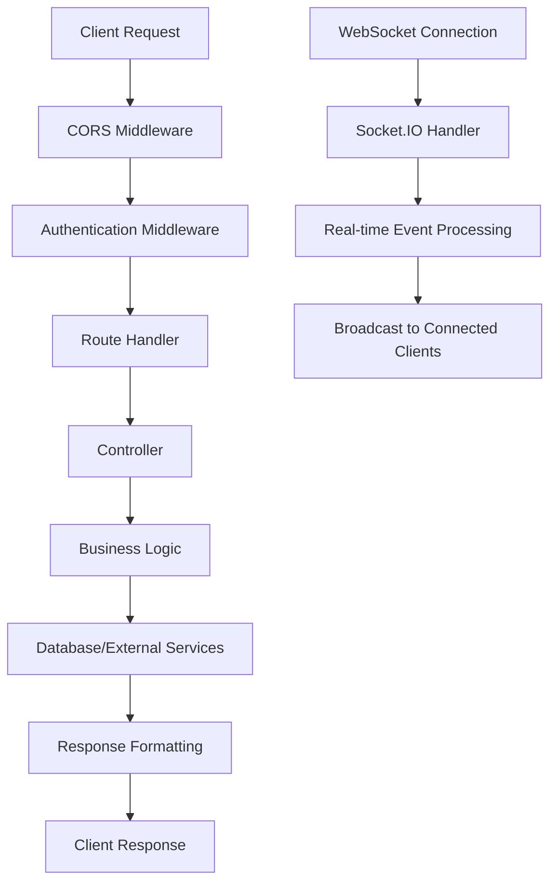

<div align="center">

# 🌍 Travelmate Backend API


### 🚀 A Comprehensive Travel Companion Platform Backend

**Travelmate Backend** is a robust, scalable RESTful API service powering the next-generation social travel platform. Connect travelers worldwide, share experiences, and create unforgettable journeys together.

<br/>

[](https://github.com/nhatthach2703/Travelmate-BE/stargazers)
[](https://github.com/nhatthach2703/Travelmate-BE/network/members)
[](https://github.com/nhatthach2703/Travelmate-BE/issues)
[](https://github.com/nhatthach2703/Travelmate-BE/blob/main/LICENSE)

<br/>

**🛠️ Core Technologies**

<div align="center">

<p align="center">
  <a href="https://nodejs.org/">
    
  </a>
  &nbsp;&nbsp;
  <a href="https://expressjs.com/">
    
  </a>
  &nbsp;&nbsp;
  <a href="https://www.mongodb.com/">
    
  </a>
</p>

<p align="center">
  <a href="https://socket.io/">
    
  </a>
  &nbsp;&nbsp;
  <a href="https://www.docker.com/">
    
  </a>
  &nbsp;&nbsp;
  <a href="https://jwt.io/">
    
  </a>
</p>

<p align="center">
  <a href="https://cloudinary.com/">
    
  </a>
  &nbsp;&nbsp;
  <a href="https://stripe.com/">
    
  </a>
  &nbsp;&nbsp;
  <a href="https://nodemailer.com/">
    
  </a>
</p>

</div>

<br/>

### 📊 Repository Statistics

<table align="center">
  <tr>
    <td align="center">
      
    </td>
    <td align="center">
      
    </td>
    <td align="center">
      
    </td>
  </tr>
  <tr>
    <td align="center">
      
    </td>
    <td align="center">
      
    </td>
    <td align="center">
      
    </td>
  </tr>
</table>

### 🔗 Project Ecosystem

<table align="center">
  <tr>
    <td align="center">
      <a href="https://github.com/nhatthach2703/Travelmate-FE-Web">
        
      </a>
    </td>
    <td align="center">
      <a href="https://github.com/nhatthach2703/Travelmate-Android">
        
      </a>
    </td>
    <td align="center">
      <a href="https://github.com/nhatthach2703/Travelmate-FE-App">
        
      </a>
    </td>
  </tr>
</table>

---


</div>
  </tr>
  <tr>
    <td align="center">
      <a href="https://socket.io/">
        
      </a>
    </td>
    <td align="center">
      <a href="https://www.docker.com/">
        
      </a>
    </td>
    <td align="center">
      <a href="https://jwt.io/">
        
      </a>
    </td>
  </tr>
</table>

<br/>

**📊 Repository Statistics**

<div align="center">

| Stats | Badges |
|-------|--------|
| **License** | [](https://opensource.org/licenses/MIT) |
| **Stars** | [](https://github.com/Nhatthach2703/Travelmate-BE/stargazers) |
| **Forks** | [](https://github.com/Nhatthach2703/Travelmate-BE/network/members) |
| **Issues** | [](https://github.com/Nhatthach2703/Travelmate-BE/issues) |
| **Last Commit** | [](https://github.com/Nhatthach2703/Travelmate-BE/commits/master) |

</div>

<br/>

**� Project Metrics**

<div align="center">


</div>

<br/>

[📖 **API Documentation**](http://localhost:5000/api-docs) • [🐛 **Report Bug**](https://github.com/Nhatthach2703/Travelmate-BE/issues) • [✨ **Request Feature**](https://github.com/Nhatthach2703/Travelmate-BE/issues)

</div>

---

## 📑 Table of Contents

<details>
<summary><strong>Click to expand Table of Contents</strong></summary>

- [✨ Key Features](#-key-features)
- [🛠️ Technology Stack](#️-technology-stack)
- [📋 Prerequisites](#-prerequisites)
- [⚡ Quick Start](#-quick-start)
- [📚 API Documentation](#-api-documentation)
- [🏗️ Project Architecture](#️-project-architecture)
- [🔧 Available Scripts](#-available-scripts)
- [🌐 Deployment Guide](#-deployment-guide)
- [🤝 Contributing](#-contributing)
- [📄 License](#-license)
- [👥 Team & Contributors](#-team--contributors)
- [📞 Support & Contact](#-support--contact)

</details>

---

## ✨ Key Features

<div align="center">
  
</div>

### 🔐 **Authentication & Security**
```bash
🔑 JWT-based Authentication     ✓ Access & Refresh Tokens
📧 Email Verification          ✓ Secure OTP System  
🛡️ Multi-layer Security        ✓ bcryptjs Password Hashing
👤 Role-based Access Control   ✓ Different User Types
🔄 Session Management          ✓ Automatic Token Refresh
🍪 Secure Cookie Handling      ✓ Production Ready
```

### 🗺️ **Travel Management System**
```bash
🧠 Smart Trip Planning         ✓ Customizable Itineraries
🌍 Location Intelligence       ✓ Comprehensive Travel Info
📚 Travel History Tracking     ✓ Personal Journey Records
🌤️ Weather Integration         ✓ Real-time Forecasts
🎯 AI Recommendations          ✓ Powered by Machine Learning
💱 Multi-currency Support      ✓ International Travel Ready
```

### 👥 **Social Travel Network**
```bash
🤝 Advanced Matching           ✓ Compatible Travel Companions
💬 Real-time Chat System       ✓ Socket.IO Instant Messaging
📝 Travel Blog Platform        ✓ Share Experiences & Tips
⭐ Community Rating System     ✓ Reviews & Feedback
👫 Connection Management       ✓ Friend Requests & Followers
🎪 Group Travel Coordination   ✓ Organize Group Adventures
```

### 📱 **Rich Media & Utilities**
```bash
☁️ Cloud Image Management      ✓ Cloudinary Integration
🔔 Real-time Notifications     ✓ Important Updates
💳 Secure Payment Processing   ✓ Stripe Integration
📊 Advanced Reporting System   ✓ Content Moderation
⚙️ Background Task Processing  ✓ Automated Reminders
📬 Email Communication         ✓ Beautiful Templates
```

### 🎯 **Premium Features**
```bash
👑 VIP Account Management      ✓ Premium Subscriptions
🚀 Priority Matching           ✓ Enhanced for VIP Users
🌟 Enhanced Profile Visibility ✓ Boosted Search Results
📈 Advanced Analytics          ✓ Travel Pattern Insights
🎁 Exclusive Travel Deals      ✓ Premium Recommendations
🆘 24/7 Customer Support       ✓ Dedicated Premium Support
```

<div align="center">
  
</div>

## 🛠️ Technology Stack

<div align="center">
  
</div>

<div align="center">

### 🚀 **Core Technologies**
| Technology | Badge | Version | Purpose |
|------------|-------|---------|---------|
| **Node.js** |  | 16+ | Runtime Environment |
| **Express.js** |  | 4.16+ | Web Framework |
| **MongoDB** |  | 4.4+ | Database |
| **Mongoose** |  | Latest | ODM |

### 🔒 **Security & Authentication**
| Technology | Badge | Purpose |
|------------|-------|---------|
| **JWT** |  | Token Authentication |
| **bcryptjs** |  | Password Hashing |
| **Crypto** |  | Encryption |

### ⚡ **Real-time & Communication**
| Technology | Badge | Purpose |
|------------|-------|---------|
| **Socket.IO** |  | Real-time Communication |
| **Nodemailer** |  | Email Service |

### ☁️ **Cloud & External Services**
| Service | Badge | Purpose |
|---------|-------|---------|
| **Cloudinary** |  | Media Management |
| **Stripe** |  | Payment Processing |
| **OpenWeather** |  | Weather API |

### 🚀 **DevOps & Deployment**
| Tool | Badge | Purpose |
|------|-------|---------|
| **Docker** |  | Containerization |
| **GitHub Actions** |  | CI/CD Pipeline |
| **Swagger** |  | API Documentation |
| **node-cron** |  | Task Scheduling |

</div>

<div align="center">
  
</div>

### 🏗️ Architecture Highlights

- **RESTful API Design** with proper HTTP status codes and methods
- **Microservices-ready** architecture with modular components
- **Event-driven** real-time communication via WebSocket
- **Scalable** horizontal scaling with Docker containers
- **Security-first** approach with multiple layers of protection
- **Performance-optimized** with efficient database queries and caching strategies

## 📋 Prerequisites

Before you begin, ensure you have the following installed on your development machine:

| Requirement | Version | Download Link |
|-------------|---------|---------------|
| **Node.js** | >= 16.0.0 | [Download](https://nodejs.org/) |
| **npm** | >= 8.0.0 | Included with Node.js |
| **MongoDB** | >= 4.4 | [Download](https://www.mongodb.com/try/download/community) |
| **Git** | Latest | [Download](https://git-scm.com/downloads) |
| **Docker** | Latest (Optional) | [Download](https://www.docker.com/get-started) |

### 🔧 Development Tools (Recommended)

- **MongoDB Compass** - GUI for MongoDB
- **Postman** - API testing
- **VS Code** - Code editor with extensions:
  - Thunder Client
  - MongoDB for VS Code
  - Docker
  - GitLens

## ⚡ Quick Start

<div align="center">



</div>

### 🚀 Method 1: Local Development

#### 1. Clone the Repository
```bash
# Clone the repository
git clone https://github.com/Nhatthach2703/Travelmate-BE.git

# Navigate to project directory
cd Travelmate-BE

# Check out to development branch (if available)
git checkout develop
```

#### 2. Install Dependencies
```bash
# Install all dependencies
npm install

# For production-only dependencies
npm install --only=production
```

#### 3. Environment Configuration
```bash
# Copy environment template
cp .env.example .env

# Edit the environment file with your preferred editor
nano .env
# or
code .env
```

**Required Environment Variables:**
```env
# 🌐 Server Configuration
PORT=5000
NODE_ENV=development

# 🗄️ Database Configuration
MONGODB_URI=mongodb://localhost:27017/travelmate_dev

# 🔐 JWT Configuration
JWT_SECRET=your_super_secret_jwt_key_min_32_characters
JWT_REFRESH_SECRET=your_super_secret_refresh_key_min_32_characters

# 📧 Email Service (Gmail recommended)
EMAIL_USER=your-email@gmail.com
EMAIL_PASS=your-app-specific-password

# ☁️ Cloudinary Configuration
CLOUDINARY_CLOUD_NAME=your_cloud_name
CLOUDINARY_API_KEY=your_api_key
CLOUDINARY_API_SECRET=your_api_secret

# 🌤️ Weather API
WEATHER_API_KEY=your_weather_api_key

# 🤖 AI Integration
GEMINI_API_KEY=your_gemini_api_key

# 💳 Payment Processing
STRIPE_SECRET_KEY=sk_test_your_stripe_secret_key

# 🍪 Cookie Configuration (Production only)
COOKIE_DOMAIN=.your-domain.com   # Replace with your actual domain
```

#### 4. Database Setup
```bash
# Make sure MongoDB is running
sudo systemctl start mongod  # Linux
brew services start mongodb  # macOS
# For Windows, start MongoDB service from Services

# Verify MongoDB connection
mongo --eval "db.version()"
```

#### 5. Start the Application
```bash
# Development mode with auto-reload
npm start

# Production mode
NODE_ENV=production npm start
```

The server will be available at **http://localhost:5000** 🎉

### 🐳 Method 2: Docker Development

#### 1. Using Docker Compose (Recommended)
```bash
# Clone and navigate to project
git clone https://github.com/Nhatthach2703/Travelmate-BE.git
cd Travelmate-BE

# Create environment file
cp .env.example .env

# Build and start all services
docker-compose up --build

# Run in detached mode
docker-compose up -d

# View logs
docker-compose logs -f api
```

#### 2. Manual Docker Build
```bash
# Build the Docker image
docker build -t travelmate-backend .

# Run the container
docker run -p 5000:5000 --env-file .env travelmate-backend

# Run with volume mounting for development
docker run -p 5000:5000 --env-file .env -v $(pwd):/usr/src/app travelmate-backend
```

### 🔍 Verify Installation

1. **Health Check**
   ```bash
   curl http://localhost:5000/
   ```

2. **API Documentation**
   Open [http://localhost:5000/api-docs](http://localhost:5000/api-docs) in your browser

3. **Test Endpoint**
   ```bash
   curl http://localhost:5000/test
   ```

## 📚 API Documentation

Our comprehensive API documentation is automatically generated and interactive, powered by **Swagger UI**.

### 🌐 Access API Documentation

| Environment | URL | Description |
|-------------|-----|-------------|
| **Local Development** | [http://localhost:5000/api-docs](http://localhost:5000/api-docs) | Interactive API explorer |
| **Production** | `/api-docs` endpoint | Live API documentation when deployed |

### 🔗 API Endpoints Overview

<div align="center">

**📊 API Statistics**


</div>

<div align="center">

| 🛣️ Route | 📝 Description | 🔐 Auth Required | 📊 Methods |
|----------|-----------------|------------------|------------|
| `/auth` | Authentication & Registration | ❌ | `POST` |
| `/users` | User Profile Management | ✅ | `GET, PUT, DELETE` |
| `/travelInfo` | Travel Destinations & Info | ✅ | `GET, POST, PUT, DELETE` |
| `/travelPlan` | Trip Planning & Itineraries | ✅ | `GET, POST, PUT, DELETE` |
| `/travelHistory` | Travel History Tracking | ✅ | `GET, POST` |
| `/blog` | Travel Blog & Articles | ✅ | `GET, POST, PUT, DELETE` |
| `/chat` | Real-time Messaging | ✅ | `GET, POST` |
| `/matchUser` | Travel Companion Matching | ✅ | `GET, POST` |
| `/connections` | Friend Requests & Connections | ✅ | `GET, POST, PUT, DELETE` |
| `/rating` | Reviews & Ratings | ✅ | `GET, POST, PUT` |
| `/notifications` | Push Notifications | ✅ | `GET, PUT, DELETE` |
| `/userAlbum` | Photo Album Management | ✅ | `GET, POST, PUT, DELETE` |
| `/albumImage` | Image Upload & Management | ✅ | `POST, DELETE` |
| `/weather` | Weather Information | ✅ | `GET` |
| `/stripe` | Payment Processing | ✅ | `POST` |
| `/report` | Content Reporting | ✅ | `POST` |
| `/test` | Development Testing | ❌ | `GET` |

</div>

### 🔍 Example API Calls

<details>
<summary><strong>Authentication Flow</strong></summary>

```bash
# Register new user
curl -X POST http://localhost:5000/auth/register \
  -H "Content-Type: application/json" \
  -d '{
    "fullName": "John Doe",
    "email": "john@example.com",
    "username": "johndoe",
    "password": "securePassword123"
  }'

# Login
curl -X POST http://localhost:5000/auth/login \
  -H "Content-Type: application/json" \
  -d '{
    "username": "johndoe",
    "password": "securePassword123"
  }'

# Verify email with OTP
curl -X POST http://localhost:5000/auth/verify-email \
  -H "Content-Type: application/json" \
  -d '{
    "email": "john@example.com",
    "otpCode": "123456"
  }'
```

</details>

<details>
<summary><strong>Travel Planning</strong></summary>

```bash
# Get user's travel plans
curl -X GET http://localhost:5000/travelPlan \
  -H "Authorization: Bearer YOUR_JWT_TOKEN"

# Create new travel plan
curl -X POST http://localhost:5000/travelPlan \
  -H "Authorization: Bearer YOUR_JWT_TOKEN" \
  -H "Content-Type: application/json" \
  -d '{
    "title": "Tokyo Adventure",
    "destination": "Tokyo, Japan",
    "startDate": "2024-06-01",
    "endDate": "2024-06-07",
    "budget": 2000,
    "description": "Exploring the vibrant culture of Tokyo"
  }'
```

</details>

<details>
<summary><strong>Real-time Chat</strong></summary>

```javascript
// Socket.IO client connection
const socket = io('http://localhost:5000', {
  auth: {
    token: 'YOUR_JWT_TOKEN'
  }
});

// Join a chat room
socket.emit('joinRoom', { roomId: 'room_123' });

// Send message
socket.emit('sendMessage', {
  roomId: 'room_123',
  message: 'Hello, fellow travelers!'
});

// Listen for messages
socket.on('newMessage', (data) => {
  console.log('New message:', data);
});
```

</details>

### 📊 Response Format

All API responses follow a consistent format:

```json
{
  "success": true,
  "message": "Operation completed successfully",
  "data": {
    // Response data here
  },
  "timestamp": "2024-01-15T10:30:00.000Z",
  "requestId": "req_abc123"
}
```

### ⚠️ Error Handling

Error responses include detailed information:

```json
{
  "success": false,
  "message": "Validation failed",
  "error": {
    "code": "VALIDATION_ERROR",
    "details": [
      {
        "field": "email",
        "message": "Invalid email format"
      }
    ]
  },
  "timestamp": "2024-01-15T10:30:00.000Z",
  "requestId": "req_abc123"
}
```

## 🏗️ Project Architecture

<div align="center">

```
┌─────────────────────────────────────────────────────────────┐
│                     🌐 Client Applications                  │
│        (Web App, Mobile App, Third-party Services)          │
└─────────────────────┬───────────────────────────────────────┘
                      │ HTTPS/WSS
┌─────────────────────▼───────────────────────────────────────┐
│                  🛡️ API Gateway & Middleware                │
│            (CORS, Auth, Rate Limiting, Logging)             │
└─────────────────────┬───────────────────────────────────────┘
                      │
┌─────────────────────▼───────────────────────────────────────┐
│                   🎯 Express.js Routes                      │
│     /auth  /users  /chat  /travel  /payment  /media        │
└─────────────────────┬───────────────────────────────────────┘
                      │
┌─────────────────────▼───────────────────────────────────────┐
│                 🏭 Business Logic Layer                     │
│            (Controllers, Services, Validation)              │
└─────┬─────────┬─────────┬─────────┬─────────┬───────────────┘
      │         │         │         │         │
      ▼         ▼         ▼         ▼         ▼
   ┌─────┐  ┌─────┐   ┌─────┐   ┌─────┐   ┌─────┐
   │ 🗄️  │  │ ☁️  │   │ 💳  │   │ 📧  │   │ 🌤️ │
   │ DB  │  │Cloud│   │Stripe│   │Email│   │API │
   │     │  │     │   │     │   │     │   │    │
   └─────┘  └─────┘   └─────┘   └─────┘   └─────┘
```

</div>

### 📁 Detailed Project Structure

```
Travelmate-BE/
├── 📁 .github/workflows/           # 🚀 CI/CD Pipeline
│   └── deploy.yml                  # GitHub Actions deployment config
│
├── 📁 batchs/                      # ⏰ Background Job Management
│   ├── batchManager.js             # Central job coordinator
│   ├── 📁 jobs/                    # Scheduled job definitions
│   │   ├── RenewVipAccountReminderJob.js    # VIP account reminders
│   │   ├── TravelRatingReminderJob.js       # Post-travel rating prompts
│   │   ├── travelReminderJob.js             # Trip notifications
│   │   └── TravelUpdateStatusReminderJob.js # Status update reminders
│   └── 📁 schedulers/              # Job scheduling logic
│       └── scheduler.js            # Cron job scheduler
│
├── 📁 bin/                         # 🚪 Application Entry Points
│   ├── cert.pem                    # SSL certificate
│   ├── key.pem                     # SSL private key
│   └── www                         # HTTP server bootstrap
│
├── 📁 configs/                     # ⚙️ Configuration Management
│   ├── cloudinary.js               # Image storage config
│   ├── corsConfig.js               # Cross-origin resource sharing
│   ├── dbConfig.js                 # Database connection setup
│   └── socket.js                   # WebSocket configuration
│
├── 📁 controllers/                 # 🎮 Business Logic Controllers
│   ├── authController.js           # Authentication & authorization
│   ├── userController.js           # User profile management
│   ├── travelInfoController.js     # Travel destination data
│   ├── travelPlanController.js     # Trip planning logic
│   ├── travelHistoryController.js  # Travel history tracking
│   ├── chatController.js           # Real-time messaging
│   ├── blogController.js           # Blog content management
│   ├── matchUserController.js      # Companion matching algorithm
│   ├── connectionController.js     # Social connections
│   ├── ratingController.js         # Review & rating system
│   ├── notificationController.js   # Push notification handling
│   ├── stripeController.js         # Payment processing
│   ├── reportController.js         # Content reporting & moderation
│   ├── userAlbumController.js      # Photo album management
│   ├── albumImageController.js     # Individual image operations
│   ├── apiWeatherController.js     # Weather data integration
│   ├── accountController.js        # Account management
│   ├── blogCommentController.js    # Blog comment system
│   ├── blogReactionController.js   # Blog reactions (likes, etc.)
│   └── successController.js        # Payment success handling
│
├── 📁 middlewares/                 # 🛡️ Request Processing Middleware
│   ├── authMiddleware.js           # JWT token verification
│   └── debugMiddleware.js          # Development debugging tools
│
├── 📁 models/                      # 🗃️ Database Schema Definitions
│   ├── Account.js                  # User account credentials
│   ├── User.js                     # User profile information
│   ├── TravelInfo.js               # Travel destination details
│   ├── TravelPlan.js               # Trip planning data
│   ├── TravelHistory.js            # Historical travel records
│   ├── ChatRoom.js                 # Chat room metadata
│   ├── Message.js                  # Chat message structure
│   ├── Blog.js                     # Blog post schema
│   ├── BlogComment.js              # Blog comment system
│   ├── BlogReaction.js             # Blog reactions & interactions
│   ├── Rating.js                   # Review & rating data
│   ├── Notification.js             # Notification structure
│   ├── Report.js                   # Content report schema
│   ├── Transaction.js              # Payment transaction records
│   ├── UserAlbum.js                # Photo album metadata
│   └── AlbumImage.js               # Individual image data
│
├── 📁 routes/                      # 🛣️ API Route Definitions
│   ├── authRoutes.js               # Authentication endpoints
│   ├── userRouters.js              # User management routes
│   ├── travelInfoRouters.js        # Travel info endpoints
│   ├── travelPlanRouters.js        # Trip planning routes
│   ├── travelHistroyRouters.js     # Travel history endpoints
│   ├── chatRouters.js              # Messaging routes
│   ├── blogRouters.js              # Blog management routes
│   ├── matchUserRouters.js         # Matching algorithm routes
│   ├── connectionRouters.js        # Social connection routes
│   ├── ratingRouters.js            # Rating & review routes
│   ├── notificationRouters.js      # Notification endpoints
│   ├── stripeRoutes.js             # Payment processing routes
│   ├── reportRoters.js             # Content reporting routes
│   ├── userAlbumRouters.js         # Album management routes
│   ├── albumImageRouters.js        # Image operation routes
│   ├── apiWeatherRouters.js        # Weather API routes
│   ├── accountRouters.js           # Account management routes
│   ├── testRoutes.js               # Development testing routes
│   ├── success.js                  # Payment success routes
│   ├── cancel.js                   # Payment cancellation routes
│   └── index.js                    # Root route handler
│
├── 📁 utils/                       # 🔧 Utility Functions
│   ├── chatUtils.js                # Chat-related utilities
│   ├── cloudinaryUtils.js          # Image processing utilities
│   ├── mailer.js                   # Email sending utilities
│   └── notificationUtils.js        # Notification helpers
│
├── 📁 tests/                       # 🧪 Testing & Documentation
│   ├── api-docs.yaml               # OpenAPI specification
│   ├── swaggerOptions.js           # Swagger configuration
│   ├── testAddDataUser.js          # Test data seeding
│   ├── 📁 routes/                  # Route-specific tests
│   └── 📁 swagger/                 # API documentation assets
│
├── 📁 public/                      # 🌐 Static Assets
│   ├── favicon.ico                 # Application icon
│   ├── index1.html                 # Landing page
│   ├── 📁 images/                  # Static images
│   ├── 📁 javascripts/             # Client-side scripts
│   └── 📁 stylesheets/             # CSS styling
│       └── style.css               # Main stylesheet
│
├── 📄 app.js                       # 🚀 Express Application Setup
├── 📄 package.json                 # 📦 Dependencies & Scripts
├── 📄 package-lock.json            # 🔒 Dependency Lock File
├── 📄 nodemon.json                 # 🔄 Development Auto-reload Config
├── 📄 tsconfig.json                # 📝 TypeScript Configuration
├── 📄 docker-compose.yml           # 🐳 Docker Multi-container Setup
├── 📄 Dockerfile                   # 🐳 Docker Image Definition
├── 📄 .dockerignore                # 🐳 Docker Build Exclusions
├── 📄 .gitignore                   # 📚 Git Exclusions
├── 📄 .env.example                 # 🔧 Environment Variables Template
├── 📄 .env                         # 🔐 Environment Variables (Local)
└── 📄 README.md                    # 📖 Project Documentation
```

### 🔄 Data Flow Architecture



### 🎯 Key Architectural Patterns

- **🏛️ MVC Architecture**: Clear separation of Models, Views, and Controllers
- **🔌 Middleware Pattern**: Layered request processing with reusable components  
- **📡 Event-Driven**: Real-time features using WebSocket events
- **🗃️ Repository Pattern**: Abstracted data access layer with Mongoose
- **🔧 Dependency Injection**: Modular service integration
- **🛡️ Security-First**: Multiple security layers and validation
- **📊 RESTful Design**: Standardized API design following REST principles
- **⚡ Async/Await**: Modern JavaScript async programming patterns

## 🔧 Available Scripts

| Command | Description | Usage |
|---------|-------------|-------|
| `npm start` | Start development server with nodemon | `npm start` |
| `npm run prod` | Start production server | `npm run prod` |
| `npm test` | Run test suite | `npm test` |
| `npm run test:watch` | Run tests in watch mode | `npm run test:watch` |
| `npm run lint` | Check code style and quality | `npm run lint` |
| `npm run lint:fix` | Fix linting issues automatically | `npm run lint:fix` |
| `npm run docs` | Generate API documentation | `npm run docs` |
| `npm run build` | Build for production | `npm run build` |

### 🐳 Docker Commands

```bash
# Build Docker image
docker build -t travelmate-backend .

# Run single container
docker run -p 5000:5000 --env-file .env travelmate-backend

# Use Docker Compose for full stack
docker-compose up --build

# Run in background (detached mode)
docker-compose up -d

# View container logs
docker-compose logs -f api

# Stop all services
docker-compose down

# Stop and remove volumes
docker-compose down -v

# Rebuild and restart
docker-compose up --build --force-recreate
```

## 🌐 Deployment Guide

### 🚀 Production Deployment Options

<details>
<summary><strong>🔷 Option 1: Traditional VPS/Server Deployment</strong></summary>

#### Prerequisites
- Ubuntu 20.04+ or CentOS 8+
- Node.js 16+ installed
- MongoDB installed or MongoDB Atlas account
- Domain name with SSL certificate
- PM2 for process management

#### Step-by-step Deployment

1. **Server Setup**
```bash
# Update system packages
sudo apt update && sudo apt upgrade -y

# Install Node.js
curl -fsSL https://deb.nodesource.com/setup_18.x | sudo -E bash -
sudo apt-get install -y nodejs

# Install PM2 globally
sudo npm install -g pm2

# Install Nginx (optional - for reverse proxy)
sudo apt install nginx -y
```

2. **Application Deployment**
```bash
# Clone the repository
git clone https://github.com/Nhatthach2703/Travelmate-BE.git
cd Travelmate-BE

# Install dependencies
npm install --production

# Create production environment file
cp .env.example .env.production
nano .env.production

# Start with PM2
pm2 start app.js --name "travelmate-api"
pm2 startup
pm2 save
```

3. **Nginx Configuration** (Optional)
```nginx
server {
    listen 80;
    server_name api.your-domain.com;  # Replace with your actual domain

    location / {
        proxy_pass http://localhost:5000;
        proxy_http_version 1.1;
        proxy_set_header Upgrade $http_upgrade;
        proxy_set_header Connection 'upgrade';
        proxy_set_header Host $host;
        proxy_cache_bypass $http_upgrade;
        proxy_set_header X-Real-IP $remote_addr;
        proxy_set_header X-Forwarded-For $proxy_add_x_forwarded_for;
        proxy_set_header X-Forwarded-Proto $scheme;
    }
}
```

</details>

<details>
<summary><strong>🔶 Option 2: Docker Container Deployment</strong></summary>

#### Using Docker Compose in Production

1. **Production Docker Compose**
```yaml
version: '3.8'
services:
  api:
    build: .
    container_name: travelmate-api-prod
    restart: unless-stopped
    ports:
      - "5000:5000"
    environment:
      - NODE_ENV=production
    env_file: .env.production
    volumes:
      - ./logs:/usr/src/app/logs
    depends_on:
      - mongodb
      - redis

  mongodb:
    image: mongo:5.0
    container_name: travelmate-mongo
    restart: unless-stopped
    ports:
      - "27017:27017"
    environment:
      MONGO_INITDB_ROOT_USERNAME: admin
      MONGO_INITDB_ROOT_PASSWORD: your_secure_password
    volumes:
      - mongodb_data:/data/db

  redis:
    image: redis:7-alpine
    container_name: travelmate-redis
    restart: unless-stopped
    ports:
      - "6379:6379"
    volumes:
      - redis_data:/data

volumes:
  mongodb_data:
  redis_data:
```

2. **Deploy with Docker**
```bash
# Pull latest changes
git pull origin main

# Build and deploy
docker-compose -f docker-compose.prod.yml up --build -d

# Monitor logs
docker-compose -f docker-compose.prod.yml logs -f
```

</details>

<details>
<summary><strong>🔸 Option 3: Cloud Platform Deployment</strong></summary>

#### Heroku Deployment
```bash
# Install Heroku CLI
npm install -g heroku

# Login to Heroku
heroku login

# Create new app
heroku create travelmate-backend

# Set environment variables
heroku config:set NODE_ENV=production
heroku config:set MONGODB_URI=your_mongodb_atlas_uri
heroku config:set JWT_SECRET=your_jwt_secret
# ... add all other environment variables

# Deploy
git push heroku main
```

#### AWS EC2 with Auto Scaling
```bash
# Use AWS CodeDeploy for automated deployment
# Configure Auto Scaling Group
# Set up Load Balancer
# Configure CloudWatch monitoring
```

#### DigitalOcean App Platform
```yaml
# app.yaml
name: travelmate-backend
services:
- name: api
  source_dir: /
  github:
    repo: Nhatthach2703/Travelmate-BE
    branch: main
  run_command: npm start
  environment_slug: node-js
  instance_count: 1
  instance_size_slug: basic-xxs
  envs:
  - key: NODE_ENV
    value: production
  - key: PORT
    value: "8080"
```

</details>

### 🔒 Production Security Checklist

- [ ] **Environment Variables**: All sensitive data in environment variables
- [ ] **HTTPS**: SSL certificate configured and enforced
- [ ] **CORS**: Properly configured for production domains
- [ ] **Rate Limiting**: Implement rate limiting for API endpoints
- [ ] **Input Validation**: Validate and sanitize all user inputs
- [ ] **Database Security**: Use connection strings with authentication
- [ ] **Error Handling**: Don't expose sensitive error information
- [ ] **Logging**: Implement comprehensive logging and monitoring
- [ ] **Backup Strategy**: Regular database backups configured
- [ ] **Firewall**: Proper firewall rules in place

### 📊 Monitoring & Health Checks

```bash
# Health check endpoint
curl http://localhost:5000/health
# Or for production: curl http://your-api-domain.com/health

# Application metrics with PM2
pm2 monit

# System monitoring
htop
iostat -x 1
```

### 🔄 CI/CD with GitHub Actions

The project includes automated deployment via GitHub Actions. See `.github/workflows/deploy.yml` for configuration.

**Automated Deployment Triggers:**
- ✅ Push to `main` branch
- ✅ Pull request merge
- ✅ Manual workflow dispatch

**Deployment Steps:**
1. 🧪 Run tests
2. 🔍 Code quality checks
3. 🐳 Build Docker image
4. 🚀 Deploy to staging
5. ✅ Health checks
6. 🌐 Deploy to production

## 🤝 Contributing

We welcome contributions from the community! Whether you're fixing bugs, adding features, or improving documentation, your help is appreciated.

### 🌟 Ways to Contribute

- 🐛 **Bug Reports**: Found a bug? [Open an issue](https://github.com/Nhatthach2703/Travelmate-BE/issues)
- ✨ **Feature Requests**: Have an idea? [Request a feature](https://github.com/Nhatthach2703/Travelmate-BE/issues)
- 📖 **Documentation**: Help improve our docs
- 💻 **Code Contributions**: Submit pull requests
- 🧪 **Testing**: Help us improve test coverage
- 🌍 **Translations**: Add support for more languages

### 🔄 Development Workflow

1. **Fork the Repository**
   ```bash
   # Click the 'Fork' button on GitHub, then clone your fork
   git clone https://github.com/YOUR_USERNAME/Travelmate-BE.git
   cd Travelmate-BE
   ```

2. **Set Up Development Environment**
   ```bash
   # Add upstream remote
   git remote add upstream https://github.com/Nhatthach2703/Travelmate-BE.git
   
   # Install dependencies
   npm install
   
   # Copy environment variables
   cp .env.example .env
   
   # Start development server
   npm start
   ```

3. **Create Feature Branch**
   ```bash
   # Create and switch to a new branch
   git checkout -b feature/amazing-new-feature
   
   # Or for bug fixes
   git checkout -b fix/bug-description
   ```

4. **Make Your Changes**
   - Write clean, documented code
   - Follow existing code style and conventions
   - Add tests for new functionality
   - Update documentation as needed

5. **Test Your Changes**
   ```bash
   # Run tests
   npm test
   
   # Run linting
   npm run lint
   
   # Check code formatting
   npm run format:check
   ```

6. **Commit Your Changes**
   ```bash
   # Stage your changes
   git add .
   
   # Commit with a descriptive message
   git commit -m "feat: add amazing new feature for travel planning"
   
   # Follow conventional commit format:
   # feat: new feature
   # fix: bug fix
   # docs: documentation changes
   # style: formatting changes
   # refactor: code refactoring
   # test: adding tests
   # chore: maintenance tasks
   ```

7. **Push and Create Pull Request**
   ```bash
   # Push to your fork
   git push origin feature/amazing-new-feature
   
   # Go to GitHub and create a Pull Request
   ```

### 📋 Pull Request Guidelines

- ✅ **Clear Description**: Explain what your PR does and why
- ✅ **Small, Focused Changes**: Keep PRs focused on a single feature/fix
- ✅ **Tests**: Include tests for new functionality
- ✅ **Documentation**: Update docs if needed
- ✅ **Code Style**: Follow existing conventions
- ✅ **Commit Messages**: Use conventional commit format
- ✅ **Up to Date**: Rebase on latest main branch

### 🎯 Code Style Guidelines

```javascript
// ✅ Good: Use descriptive variable names
const userTravelHistory = await TravelHistory.find({ userId });

// ❌ Bad: Unclear variable names
const data = await TravelHistory.find({ userId });

// ✅ Good: Proper error handling
try {
  const result = await someAsyncOperation();
  return res.status(200).json({ success: true, data: result });
} catch (error) {
  console.error('Operation failed:', error);
  return res.status(500).json({ 
    success: false, 
    message: 'Internal server error' 
  });
}

// ✅ Good: Consistent API response format
res.status(200).json({
  success: true,
  message: 'Operation completed successfully',
  data: result,
  timestamp: new Date().toISOString()
});
```

### 🧪 Testing Guidelines

- Write unit tests for new functions
- Include integration tests for API endpoints
- Ensure all tests pass before submitting PR
- Aim for good test coverage on new code

```javascript
// Example test structure
describe('Travel Plan Controller', () => {
  describe('POST /travelPlan', () => {
    it('should create a new travel plan with valid data', async () => {
      // Test implementation
    });
    
    it('should return 400 for invalid input data', async () => {
      // Test implementation
    });
  });
});
```

### 🏷️ Issue Labels

We use labels to categorize issues:

- 🐛 `bug` - Something isn't working
- ✨ `enhancement` - New feature or request
- 📖 `documentation` - Improvements or additions to documentation
- 🆘 `help wanted` - Extra attention is needed
- 🥇 `good first issue` - Good for newcomers
- 🔥 `priority: high` - High priority issue
- 🧹 `maintenance` - Code maintenance and refactoring

### 💬 Community Guidelines

- Be respectful and inclusive
- Provide constructive feedback
- Help others learn and grow
- Follow our [Code of Conduct](CODE_OF_CONDUCT.md)

### 🎉 Recognition

Contributors will be recognized in:
- GitHub contributors list
- Special mentions in release notes
- Hall of fame in documentation (for significant contributions)

---

## 📄 License

This project is licensed under the **MIT License** - see the [LICENSE](./LICENSE) file for complete details.

**What this means:**
- ✅ **Free to use** for personal and commercial projects
- ✅ **Modify and distribute** the code freely
- ✅ **Private use** allowed
- ✅ **Commercial use** permitted
- ⚠️ **No warranty** provided
- ⚠️ **Copyright notice** must be included in copies

---

## 👥 Team & Contributors

### 🏆 Project Creator & Lead Developer
- **[Nhatthach2703](https://github.com/Nhatthach2703)** - *Lead Developer & Project Architect*

### 👨‍💻 Travelmate Team
- **Development Team** - Core contributors and maintainers
- **Quality Assurance** - Testing and validation specialists  
- **DevOps Engineers** - Infrastructure and deployment experts
- **UI/UX Designers** - User experience specialists

### 🤝 Open Source Contributors
We extend our gratitude to all contributors who have helped improve this project:

<a href="https://github.com/Nhatthach2703/Travelmate-BE/graphs/contributors">
  
</a>

---

## 📞 Support & Contact

### 🆘 Getting Help

- 📚 **Documentation**: Check our [comprehensive docs](http://localhost:5000/api-docs)
- 🐛 **Bug Reports**: [Create an issue](https://github.com/Nhatthach2703/Travelmate-BE/issues)
- 💡 **Feature Requests**: [Request a feature](https://github.com/Nhatthach2703/Travelmate-BE/issues)
- 💬 **Discussions**: [Join the discussion](https://github.com/Nhatthach2703/Travelmate-BE/discussions)

### 📱 Connect With Us

- **GitHub**: [@Nhatthach2703](https://github.com/Nhatthach2703)
- **Email**: Contact via GitHub profile
- **Project Repository**: [Travelmate-BE](https://github.com/Nhatthach2703/Travelmate-BE)

### 🔗 Related Projects

- **🌐 Frontend Web Application**: [Travelmate-FE-Web](https://github.com/Nhatthach2703/Travelmate-FE-Web) - Web-based travel companion interface
- **📱 Mobile Application (Android)**: [Travelmate-Android](https://github.com/Nhatthach2703/Travelmate-Android) - Native Android mobile app
- **� Frontend Mobile App**: [Travelmate-FE-App](https://github.com/Nhatthach2703/Travelmate-FE-App) - Cross-platform mobile application
- **📖 API Documentation**: Available at `/api-docs` endpoint when server is running

---

<div align="center">

### 🌟 **Star this repository if you found it helpful!**

<br/>

<table>
  <tr>
    <td align="center">
      <a href="https://github.com/Nhatthach2703/Travelmate-BE/stargazers">
        
      </a>
      <br/>
      <sub><b>Star the Repo</b></sub>
    </td>
    <td align="center">
      <a href="https://github.com/Nhatthach2703/Travelmate-BE/network/members">
        
      </a>
      <br/>
      <sub><b>Fork the Repo</b></sub>
    </td>
    <td align="center">
      <a href="https://github.com/Nhatthach2703/Travelmate-BE/watchers">
        
      </a>
      <br/>
      <sub><b>Watch for Updates</b></sub>
    </td>
    <td align="center">
      <a href="https://github.com/Nhatthach2703/Travelmate-BE/issues">
        
      </a>
      <br/>
      <sub><b>Report Issues</b></sub>
    </td>
  </tr>
</table>

<br/>

---

<br/>

**🎯 Made with passion for the travel community**


<br/>

---

<div align="center">


### 🌟 **Show Your Support**


<br/>

<table>
  <tr>
    <td align="center" width="200">
      <a href="https://github.com/Nhatthach2703/Travelmate-BE/stargazers">
        
      </a>
      <br/>
      <sub><b>⭐ Star the Repo</b></sub>
    </td>
    <td align="center" width="200">
      <a href="https://github.com/Nhatthach2703/Travelmate-BE/network/members">
        
      </a>
      <br/>
      <sub><b>🍴 Fork the Repo</b></sub>
    </td>
    <td align="center" width="200">
      <a href="https://github.com/Nhatthach2703/Travelmate-BE/watchers">
        
      </a>
      <br/>
      <sub><b>👀 Watch for Updates</b></sub>
    </td>
    <td align="center" width="200">
      <a href="https://github.com/Nhatthach2703/Travelmate-BE/issues">
        
      </a>
      <br/>
      <sub><b>🐛 Report Issues</b></sub>
    </td>
  </tr>
</table>

<br/>

---

<br/>


<br/>

### 🎯 **Made with passion for the travel community**

<br/>

<table width="100%">
  <tr>
    <td align="center" width="20%">
      
      <br/>
      <sub><b>Global Travel Network</b></sub>
    </td>
    <td align="center" width="20%">
      
      <br/>
      <sub><b>Connect Travelers</b></sub>
    </td>
    <td align="center" width="20%">
      
      <br/>
      <sub><b>Instant Communication</b></sub>
    </td>
    <td align="center" width="20%">
      
      <br/>
      <sub><b>Cross-platform Support</b></sub>
    </td>
    <td align="center" width="20%">
      
      <br/>
      <sub><b>Enterprise Security</b></sub>
    </td>
  </tr>
</table>

<br/>

**💻 Tech Stack:** Node.js • Express.js • MongoDB • Socket.IO • JWT • Docker • Cloudinary • Stripe

**🌍 Purpose:** Connecting travelers worldwide through innovative technology

**🚀 Status:** Actively maintained and continuously improved

<br/>


<br/>


<br/>

*© 2025 Travelmate Team • Licensed under MIT • Made with ❤️ for developers worldwide*

</div>